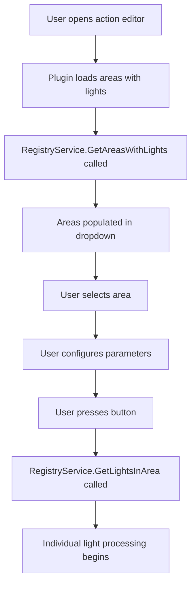

# AreaToggleLightsAction Design Document

## Overview

The `AreaToggleLightsAction` is a new Home Assistant Loupedeck plugin action that allows users to control all lights in a selected area with advanced parameters (brightness, color temperature, hue, saturation, white levels). It follows the established plugin architecture patterns while introducing area-based light selection and individual capability filtering.

## Key Differences from AdvancedToggleLightsAction

| Aspect | AdvancedToggleLightsAction | AreaToggleLightsAction |
|--------|---------------------------|----------------------|
| **Selection Method** | User selects multiple individual lights | User selects a single area |
| **Light Discovery** | Manual light selection + additional lights textbox | Automatic discovery via `RegistryService.GetLightsInArea()` |
| **Capability Strategy** | Intersection - only features ALL lights support | Individual - send max possible to each light |
| **UI Complexity** | Primary + Additional lights controls | Single area dropdown |

## Class Structure

### Basic Class Definition

```csharp
namespace Loupedeck.HomeAssistantPlugin
{
    /// <summary>
    /// Area-based action for toggling all Home Assistant lights in a selected area.
    /// Supports brightness, color temperature, hue/saturation, and white level adjustments.
    /// Uses individual light capability filtering to send maximum possible settings to each light.
    /// </summary>
    public sealed class AreaToggleLightsAction : ActionEditorCommand, IDisposable
    {
        // Class implementation...
    }
}
```

### Service Dependencies

```csharp
// Same service dependencies as AdvancedToggleLightsAction
private IHaClient? _ha;
private ILightControlService? _lightSvc;
private ILightStateManager? _lightStateManager;
private IHomeAssistantDataService? _dataService;
private IHomeAssistantDataParser? _dataParser;
private IRegistryService? _registryService;
private readonly CapabilityService _capSvc = new();
```

### Control Constants

```csharp
// Area selection (replaces individual light selection)
private const String ControlArea = "ha_area";

// Parameter controls (same as AdvancedToggleLights)
private const String ControlBrightness = "ha_brightness";
private const String ControlTemperature = "ha_temperature";
private const String ControlHue = "ha_hue";
private const String ControlSaturation = "ha_saturation";
private const String ControlWhiteLevel = "ha_white_level";
private const String ControlColdWhiteLevel = "ha_cold_white_level";
```

### Logging and Constants

```csharp
private const String LogPrefix = "[AreaToggleLights]";
private const Int32 DebounceMs = 100;
private const Int32 AuthTimeoutSeconds = 8;

// Same parameter ranges as AdvancedToggleLights
private const Int32 MinBrightness = 1;
private const Int32 MaxBrightness = 255;
private const Int32 MinTemperature = 2000;
private const Int32 MaxTemperature = 6500;
// ... etc
```

## UI Controls Layout

### Constructor Setup

```csharp
public AreaToggleLightsAction()
{
    this.Name = "HomeAssistant.AreaToggleLights";
    this.DisplayName = "Area Toggle Lights";
    this.GroupName = "Lights";
    this.Description = "Toggle all lights in a Home Assistant area with advanced controls.";

    // Area selection dropdown (replaces individual light selection)
    this.ActionEditor.AddControlEx(new ActionEditorListbox(ControlArea, "Area (retry if empty)"));

    // Parameter controls (identical to AdvancedToggleLights)
    this.ActionEditor.AddControlEx(
        new ActionEditorTextbox(ControlBrightness, "Brightness (0-255)")
            .SetPlaceholder("128")
    );
    
    this.ActionEditor.AddControlEx(
        new ActionEditorTextbox(ControlTemperature, "Temperature (2000K-6500K)")
            .SetPlaceholder("3000")
    );
    
    // ... (same pattern for hue, saturation, white levels)
    
    this.ActionEditor.ListboxItemsRequested += this.OnListboxItemsRequested;
}
```

### Area Selection Workflow



## Core Processing Flow

### 1. Area to Lights Resolution

```csharp
protected override Boolean RunCommand(ActionEditorActionParameters ps)
{
    // Get selected area
    if (!ps.TryGetString(ControlArea, out var selectedArea) || String.IsNullOrWhiteSpace(selectedArea))
    {
        PluginLog.Warning($"{LogPrefix} No area selected");
        return false;
    }

    // Get all available lights (from LightStateManager)
    var allLights = this._lightStateManager.GetTrackedEntityIds();
    
    // Get lights in selected area
    var areaLights = this._registryService.GetLightsInArea(selectedArea, allLights).ToList();
    
    if (!areaLights.Any())
    {
        PluginLog.Warning($"{LogPrefix} No lights found in area '{selectedArea}'");
        return false;
    }

    PluginLog.Info($"{LogPrefix} Processing {areaLights.Count} lights in area '{selectedArea}'");
    // Continue with individual light processing...
}
```

### 2. Individual Capability Filtering Strategy

**Key Difference**: Unlike AdvancedToggleLights which uses `GetCommonCapabilities()` (intersection), AreaToggleLights processes each light with its individual capabilities.

```csharp
private Boolean ProcessAreaLights(IEnumerable<String> areaLights, /* parameters */)
{
    var success = true;
    
    foreach (var entityId in areaLights)
    {
        // Get INDIVIDUAL capabilities for this specific light
        var individualCaps = this._lightStateManager?.GetCapabilities(entityId) 
            ?? new LightCaps(true, false, false, false, null);
            
        // Process this light with ITS OWN capabilities
        success &= this.ProcessSingleLight(entityId, individualCaps, brightness, temperature, hue, saturation, whiteLevel, coldWhiteLevel);
    }
    
    return success;
}
```

### 3. Individual Light Processing Logic

```csharp
private Boolean ProcessSingleLight(String entityId, LightCaps individualCaps, /* parameters */)
{
    PluginLog.Info($"{LogPrefix} Processing light: {entityId}");
    PluginLog.Info($"{LogPrefix} Individual capabilities: onoff={individualCaps.OnOff} brightness={individualCaps.Brightness} colorTemp={individualCaps.ColorTemp} colorHs={individualCaps.ColorHs}");

    // Build service call data based on INDIVIDUAL capabilities
    var serviceData = new Dictionary<String, Object>();
    
    // Add brightness if THIS light supports it and parameter is specified
    if (brightness.HasValue && individualCaps.Brightness)
    {
        var bri = HSBHelper.Clamp(brightness.Value, MinBrightness, MaxBrightness);
        serviceData["brightness"] = bri;
        PluginLog.Info($"{LogPrefix} Added brightness for {entityId}: {bri}");
    }
    else if (brightness.HasValue && !individualCaps.Brightness)
    {
        PluginLog.Info($"{LogPrefix} Skipping brightness for {entityId} - not supported");
    }
    
    // Add color temp if THIS light supports it
    if (temperature.HasValue && individualCaps.ColorTemp)
    {
        var kelvin = HSBHelper.Clamp(temperature.Value, MinTemperature, MaxTemperature);
        var mired = ColorTemp.KelvinToMired(kelvin);
        serviceData["color_temp"] = mired;
        PluginLog.Info($"{LogPrefix} Added color temp for {entityId}: {kelvin}K -> {mired} mireds");
    }
    else if (temperature.HasValue && !individualCaps.ColorTemp)
    {
        PluginLog.Info($"{LogPrefix} Skipping color temp for {entityId} - not supported");
    }
    
    // Add hue/saturation if THIS light supports it
    if (hue.HasValue && saturation.HasValue && individualCaps.ColorHs)
    {
        // Use same color mode logic as AdvancedToggleLights
        var preferredColorMode = individualCaps.PreferredColorMode ?? "hs";
        // ... (same color processing logic)
    }
    else if ((hue.HasValue || saturation.HasValue) && !individualCaps.ColorHs)
    {
        PluginLog.Info($"{LogPrefix} Skipping hue/saturation for {entityId} - not supported");
    }
    
    // Continue with same service call separation pattern as AdvancedToggleLights
    // (brightness call, then temperature call, then color call)
}
```

## Area Dropdown Population

### OnListboxItemsRequested Implementation

```csharp
private void OnListboxItemsRequested(Object? sender, ActionEditorListboxItemsRequestedEventArgs e)
{
    if (!e.ControlName.EqualsNoCase(ControlArea))
    {
        return;
    }

    PluginLog.Info($"{LogPrefix} ListboxItemsRequested for areas");
    
    try
    {
        // Ensure HA connection (same pattern as AdvancedToggleLights)
        if (!this.EnsureHaReadyAsync().GetAwaiter().GetResult())
        {
            e.AddItem("!not_connected", "Could not connect to Home Assistant", "Check URL/token");
            return;
        }

        // Initialize services if needed (same pattern)
        if (this._lightStateManager != null && this._dataService != null && this._dataParser != null)
        {
            var (success, errorMessage) = this._lightStateManager.InitOrUpdateAsync(this._dataService, this._dataParser, CancellationToken.None).GetAwaiter().GetResult();
            if (!success)
            {
                e.AddItem("!init_failed", "Failed to load area data", errorMessage ?? "Check connection");
                return;
            }
        }

        // Get all available lights
        var allLights = this._lightStateManager.GetTrackedEntityIds();
        
        // Get areas that have lights
        var areasWithLights = this._registryService.GetAreasWithLights(allLights);
        
        var count = 0;
        foreach (var areaId in areasWithLights)
        {
            var areaName = this._registryService.GetAreaName(areaId) ?? areaId;
            var lightsInArea = this._registryService.GetLightsInArea(areaId, allLights);
            var lightCount = lightsInArea.Count();
            
            var displayName = $"{areaName} ({lightCount} light{(lightCount == 1 ? "" : "s")})";
            
            e.AddItem(name: areaId, displayName: displayName, description: $"Area with {lightCount} lights");
            count++;
        }
        
        PluginLog.Info($"{LogPrefix} Populated {count} areas with lights");
        
        // Keep current selection
        var current = e.ActionEditorState?.GetControlValue(ControlArea) as String;
        if (!String.IsNullOrEmpty(current))
        {
            e.SetSelectedItemName(current);
        }
    }
    catch (Exception ex)
    {
        PluginLog.Error(ex, $"{LogPrefix} Area list population failed");
        e.AddItem("!error", "Error loading areas", ex.Message);
    }
}
```

## Error Handling Patterns

### Area Validation
```csharp
// Validate area exists and has lights
if (!this._registryService.AreaExists(selectedArea))
{
    PluginLog.Warning($"{LogPrefix} Selected area '{selectedArea}' does not exist");
    this.Plugin.OnPluginStatusChanged(PluginStatus.Error, $"Area '{selectedArea}' not found");
    return false;
}
```

### Light Discovery Validation
```csharp
var areaLights = this._registryService.GetLightsInArea(selectedArea, allLights).ToList();
if (!areaLights.Any())
{
    var areaName = this._registryService.GetAreaName(selectedArea) ?? selectedArea;
    PluginLog.Warning($"{LogPrefix} No lights found in area '{areaName}'");
    this.Plugin.OnPluginStatusChanged(PluginStatus.Error, $"No lights found in area '{areaName}'");
    return false;
}
```

## Integration Points

### Service Initialization (OnLoad)
```csharp
protected override Boolean OnLoad()
{
    // Identical to AdvancedToggleLights - use same dependency injection pattern
    if (this.Plugin is HomeAssistantPlugin haPlugin)
    {
        this._ha = new HaClientAdapter(haPlugin.HaClient);
        this._dataService = new HomeAssistantDataService(this._ha);
        this._dataParser = new HomeAssistantDataParser(this._capSvc);
        this._lightStateManager = haPlugin.LightStateManager; // Singleton
        this._registryService = new RegistryService();
        this._lightSvc = new LightControlService(this._ha, DebounceMs, DebounceMs, DebounceMs);
        return true;
    }
    return false;
}
```

### Resource Management (Dispose)
```csharp
public void Dispose()
{
    // Identical to AdvancedToggleLights
    if (this._disposed) return;
    
    this._lightSvc?.Dispose();
    this._lightSvc = null;
    
    // Don't dispose shared services
    this._ha = null;
    this._dataService = null;
    this._dataParser = null;
    this._lightStateManager = null;
    this._registryService = null;
    
    this._disposed = true;
}
```

## State Management Integration

### Light State Updates
```csharp
// Same pattern as AdvancedToggleLights for state management
if (success && this._lightStateManager != null)
{
    // Update local state for each processed light
    this._lightStateManager.UpdateLightState(entityId, true, brightness);
    
    if (hue.HasValue || saturation.HasValue)
    {
        this._lightStateManager.UpdateHsColor(entityId, hue, saturation);
    }
    
    if (temperature.HasValue)
    {
        var kelvin = HSBHelper.Clamp(temperature.Value, MinTemperature, MaxTemperature);
        this._lightStateManager.UpdateColorTemp(entityId, null, kelvin, null, null);
    }
}
```

## Testing Considerations

### Unit Test Categories
1. **Area Selection Logic**
   - Empty areas handling
   - Areas with no lights
   - Areas with mixed light capabilities

2. **Individual Capability Filtering**
   - Lights with different capability combinations
   - Parameter filtering per light
   - Capability-based service call generation

3. **Service Integration**
   - RegistryService method calls
   - LightStateManager integration
   - Error handling scenarios

### Edge Cases
1. **Area Changes**: Area deleted/renamed between dropdown load and execution
2. **Light Removal**: Lights removed from area between selection and execution  
3. **Mixed Capabilities**: Area with RGBW, RGB, and brightness-only lights
4. **Connection Issues**: Network failures during multi-light processing
5. **Empty Parameters**: No parameters specified (should do simple toggle for all lights)

## Implementation Priority

1. **Phase 1**: Basic class structure and area selection UI
2. **Phase 2**: Individual capability filtering logic  
3. **Phase 3**: Service integration and state management
4. **Phase 4**: Error handling and edge cases
5. **Phase 5**: Testing and polish

This design maintains consistency with the existing plugin architecture while providing the requested area-based functionality and individual capability filtering strategy.